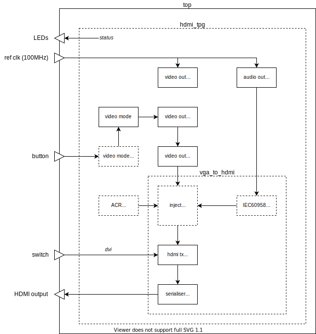

= hdmi_tpg

This design generates a video test pattern at resolutions from SD to full HD, and an audio test tone, for HDMI displays.

Supported boards: *Digilent Nexys Video* and *QMTECH Wukong*.

image::./hdmi_tpg.png[title="Example display (640x480).",align="center"]

Note that the 1080p (1485Mbps) display modes overclock the TMDS SelectIO outputs of the Xilinx 7-series FPGA.

---

== Building and Programming

Build the Vivado or Quartus project by running `make` in the relevant `build` directory, and program your board from the command line by running `make prog`. Once the project is built, you may use the IDE.

== Operation

When the programming process has completed, the monitor should display the image shown in Figure 1 above. The display mode is cycled by pressing a button (BTNC on the Digilent Nexys Video, SW3 on the QMTECH Wukong):

    Mode   Description
    ====   =================
     0     640x480p60
     1     720x480p60 4:3
     2     720x480p60 16:9
     3     1280x720p60
     4     1920x1080i60
     5     720x480i60 4:3
     6     720x480i60 16:9
     7     1920x1080p60
     8     720x576p50 4:3
     9     720x576p50 16:9
     10    1280x720p50
     11    1920x1080i50
     12    720x576i50 4:3
     13    720x576i50 16:9
     14    1920x1080p50

Note that the aspect ratio is signalled by AVI InfoFrames, but this does not work automatically with all HDTVs.

On the Nexys Video, switch SW0 sets DVI mode (all HDMI enhancements to TMDS encoding are disabled, including audio).

LEDs indicate the current state as follows:

Digilent Nexys Video:: LD7 indicates DVI (not HDMI) mode; LD6 and LD5 indicate that the audio and video clocks are locked, and LD4 is a heartbeat. LD3..0 indicate the current video mode number as 4-bit binary number.

QMTECH Wukong:: D5 indicates the MMCM lock state: 4Hz = all unlocked, 2Hz = partial lock, 1Hz = all locked. D6 shows the LSB of the current binary mode number (on = 1).

== Design Description

The diagram below shows the main design blocks:

The blocks shown are described below.

top:: A board specific wrapper around the main design. Note that the QMTECH Wukong board's system clock is 50MHz; this is doubled by an MMCM to get a 100MHz reference frequency which works well as a basis for synthesising the required video and audio clocks.

hdmi tpg:: The main design.

video out clock:: An MMCM and associated buffers, and logic to dynamically reconfigure the MMCM. Synthesises the pixel and serialiser clocks required by the current video mode.

audio out test tone:: This module produces alternating test tones (A4 to the left channel, A3 to the right channel). The `audio_clock` module instantiated within it comprises an MMCM configured to generate 256 _Fs_ (12.288MHz) from the 100MHz reference clock, and a counter to generate an _Fs_ (48kHz) clock enable.

video mode step:: This process increments the 4-bit video mode number when a button is pressed.

video mode:: Converts the 4-bit video mode number into a full set of video timing parameters (sync, blank, active etc). The source data is containied in the `video_mode.xls` spreadsheet, which can be edited and converted to VHDL by saving it as CSV and then running the `video_mode.py` Python script.

video out timing:: Synthesises basic video timing.

video out test pattern:: Generates the test pattern image (an array of vertical and horizontal lines, with colour bars.) Includes a table of reciprocals to smoothly scale the colour ramps in the centre of the image for the current output resolution.

ACR strobe:: This process generates a 1kHz strobe to ensure Audio Clock Reconstruction packets are transmitted at the intervals required by the HDMI specification.

vga to hdmi:: Top level of the VGA to HDMI conversion IP core.

IEC60958 formatting:: Formats the parallel PCM sample stream into frames with channel status in accordance with IEC60958-3.

inject:: The HDMI specification enhances the TMDS encoding of the DVI specification to allow extra data to be carried in video blanking periods. This process delays incoming video to detect and measure these blanking periods, so that the following can be inserted:

  * video preambles and guard bands
  * data islands - preamble, leading guard band, packet(s), trailing guard band

hdmi tx encoder:: Follows the HDMI specification's recipe for TMDS encoding to create 10-bit TMDS/TERC4 symbols.

tmds tx serialiser selectio:: Converts the 10-bit symbol stream from parallel to serial for each HDMI output channel, and is also used to generate a HDMI (pixel) clock. Drives out via SelectIO (TMDS differential) buffers.

== Simulation

A simulation of the top level is provided as part of the Vivado project. The UUT is run for long enough to capture a full video frame in each of the 15 video modes. The video capture results are dumped in numbered BMP files. Data packets are extracted and may be inspected using the waveform viewer. Note that simulation run times are substantial.

++++

++++