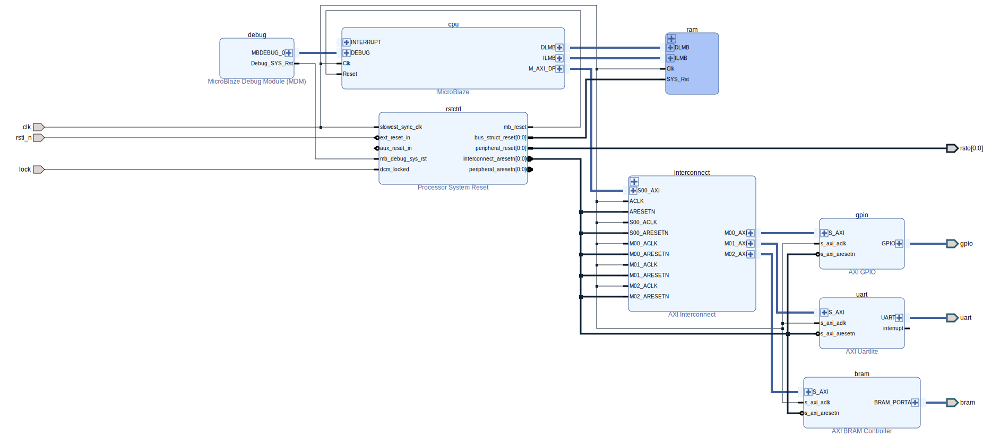

== mb_cb

This design combines a MicroBlaze CPU with a character buffer display, similar to the text modes of a PC VGA adapter.

Supported boards: *Digilent Nexys Video* and *QMTECH Wukong*.

image::./mb_cb_80x25.png[title="Example display (80 x 25 characters).",align="center"]

Two display modes are supported:

* 720x480i60 - 80 x 25 characters
* 720x576i50 - 80 x 32 characters

The text is held in a character buffer RAM, with 16 bits per character. The lower 8 bits hold the character code, and the upper 8 bits hold the background and foreground colour attributes. The 16 colour CGA palette is used. The border colour may also be specified.

8 x 16 pixel character patterns are used, and the character set is the well known link:https://en.wikipedia.org/wiki/Code_page_437[code page 437].

A demonstration MicroBlaze application is provided. This includes a minimal `printf` implementation (credit to link:https://github.com/cjlano/tinyprintf[Kustaa Nyholm / SpareTimeLabs]), and character attribute control.

== Building and Programming

Build the Vivado or Quartus project by running `make` in the relevant `build` directory, and program your board from the command line by running `make prog`. Once the project is built, you may use the IDE.

Note that `make sim` carries out essential steps for simulation and should be run once before attempting to use the simulator via the IDE.

== Design Description

The Digilent Nexys Video version is described here. Other versions are very similar.

The top entity is a board specific wrapper, named after the main design and the board (`mb_cb_digilent_nexys_video`). This instantiates the main design as well as platform specific clocking and video output components, as follows:

* *MMCM_CPU*: An MMCM configured to generates a 100MHz CPU clock and reset from a 100MHz reference.
* *MMCM_PIX*: An MMCM configured to generate a 27MHz pixel clock and reset, as well as a 135MHz HDMI serialiser clock, from a 100MHz reference.
* *MAIN*: The main design (`mb_cb`). This accepts the above clocks and resets, and drives a generic parallel "VGA" video output. This instantiates 2 components:
** *CPU*: The MicroBlaze CPU subsystem. See below.
** *DISPLAY*: The display subsystem. This instantiates a video timing generator, a dual port RAM and a character ROM. It includes all the control and glue logic required to drive addresses to the RAM and onto the character ROM as required to produce pixels at the right moment for the parallel video output.
* *HDMI_CONV*: A `vga_to_hdmi` IP core which accepts parallel video, and generates an HDMI compliant parallel TMDS symbol stream.
* *HDMI_DATA*: Serialisers (one each for red, green and blue) which convert 10-bit parallel TMDS symbols at pixel clock rate into a serial bitstream ready for output to the display monitor.
* *HDMI_CLK*: A serialiser dedicated to outputting a pixel clock coherent with the HDMI serial data streams.

=== MicroBlaze CPU Subsystem

The MicroBlaze CPU is instantiated within a Xilinx Block Diagram file:

The blocks are described below:

* *cpu*: MicroBlaze CPU, 32 bit, microcontroller preset, no caches.
* *ram*: 64kBytes for CPU instructions and data.
* *interconnect*: AXI interconnect to allow the CPU AXI master to connect to 3 AXI slaves.
* *gpio*: AXI GPIO IP core, configured for 2 channels: 8 outputs on the first channel, 8 inputs on the second.
* *uart*: "Lite" UART IP core, fixed at 115200N81, to provide console I/O (not used in this design).
* *bram*: Bridges from an AXI Slave to an external block RAM port.
* *rstctrl*: Reset controller IP core.
* *debug*: CPU debug controller IP core.

If you alter the block diagram in Vivado, you will need to export a TCL script to recreate by entering the following command in the TCL Console:

 write_bd_tcl -force -include_layout ../../../src/designs/mb_cb/microblaze.tcl
 
To update the documentation, export an SVG image by entering the following command in the TCL Console:

 write_bd_layout ‑force ‑format svg ../../../doc/designs/mb_cb/microblaze.svg

== MicroBlaze Software

The application initialises the display, prints a banner, and then fills the rest of the screen with coloured messages.

== Simulation

A simulation testbench is provided as part of the Vivado project. This captures the video output to a BMP file. Note that simulation run times are substantial. A reduced testbench, which removes the overhead of serial HDMI encoding and decoding is also provided. This runs much faster.

++++

++++