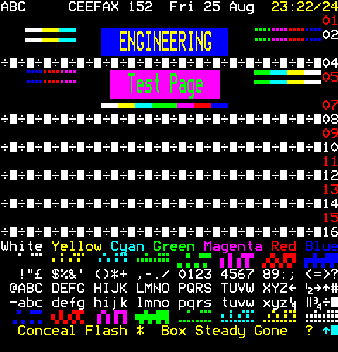

= tb_saa5050

A simulation testbench for the SAA5050 teletext character generator. Video timing is generated by an HD6845 CRTC. Uses a classic BBC Ceefax engineering test page and captures the SAA5050 output to a bitmap; the SHA1 checksum of this is then verified.

++++

++++